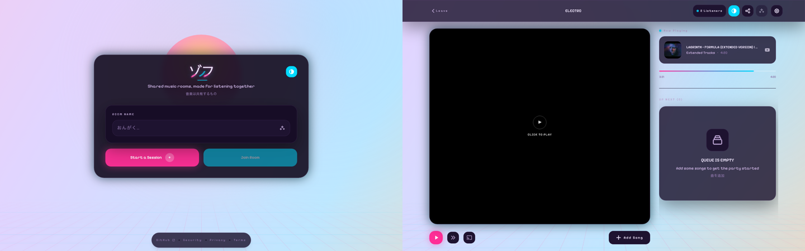

  

<h1 align="center">Listen together with Zoff</h1>

  Zoff is a shared listening platform for YouTube, Spotify, and SoundCloud.
  Start a room, invite your friends, and build the queue together.

  <a href="https://zoff.me"><strong>Open Zoff</strong></a>

  

Rooms stay in sync in real time, with collaborative queues, voting, and Google
Cast support.

Zoff is built in the open across the
[frontend](https://github.com/zoff-music/vibes-frontend),
[backend](https://github.com/zoff-music/vibes-backend), and
[database migrator](https://github.com/zoff-music/vibes-migrator).
