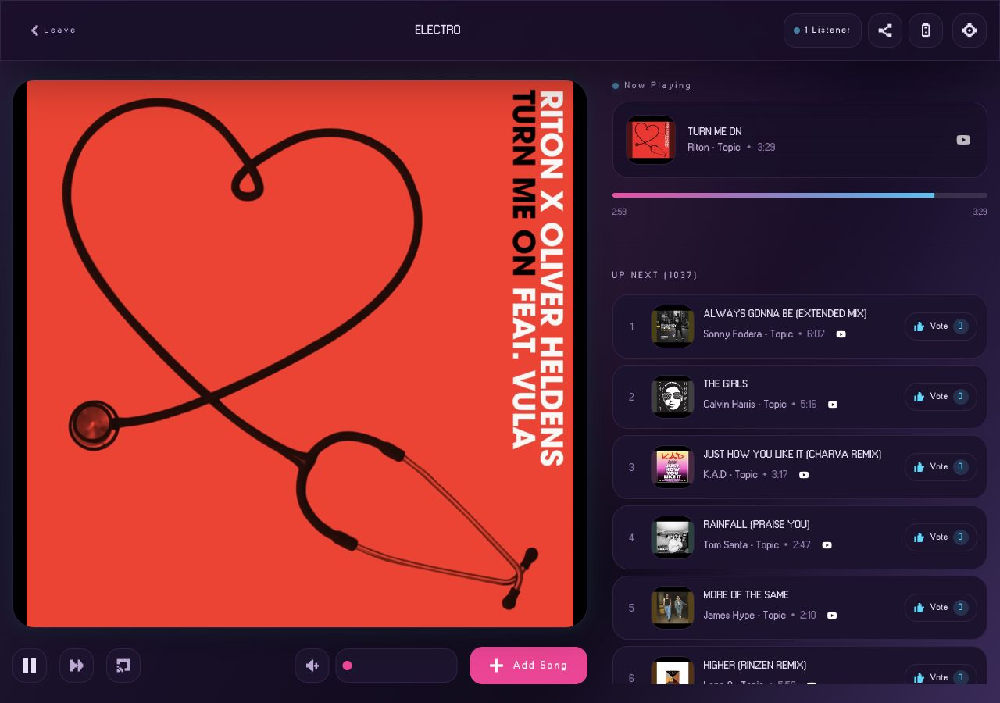

  

<h1 align="center">Listen together with Zoff</h1>

  Zoff is free shared listening for YouTube and SoundCloud.
  Start a room, invite your friends, and build the queue together. No account needed.

  <a href="https://zoff.me"><strong>Open Zoff</strong></a>

  
  

Listen in sync, add songs and vote on what plays next. Use your browser, the
mobile apps or a supported TV, and pair your phone to control another player.

Zoff is built in the open across the
[frontend](https://github.com/zoff-music/vibes-frontend),
[backend](https://github.com/zoff-music/vibes-backend), and
[database migrator](https://github.com/zoff-music/vibes-migrator).
